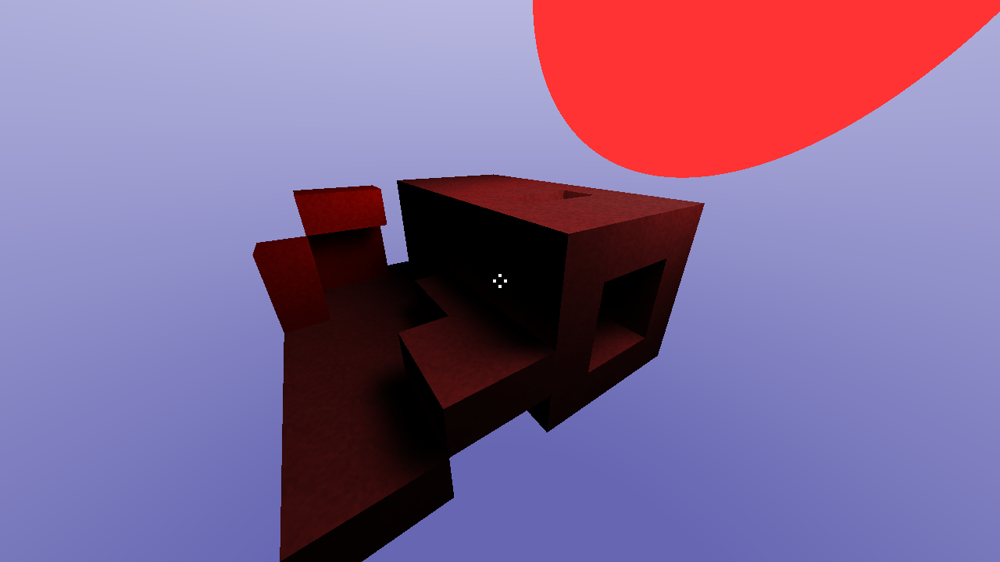
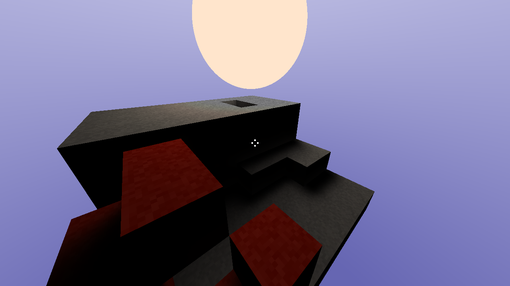
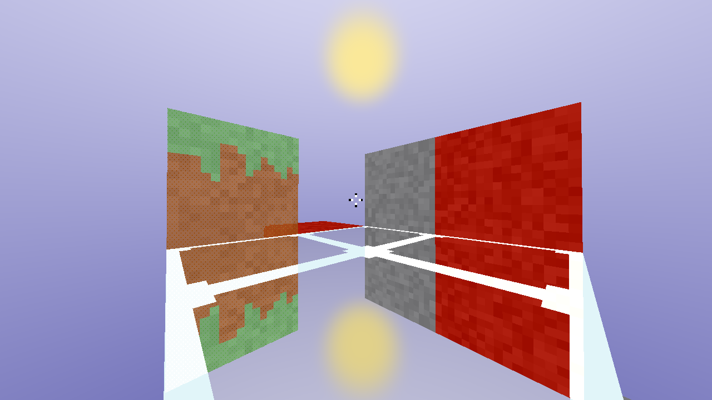
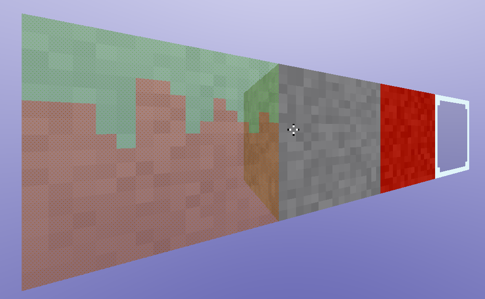

# Features
* Realtime software ray traced voxels
* Geometrically perfect reflections
* Render different texture regions based on face normal
* Screen door- and stochastic transparency
* Baked axis-aligned lightmaps with path tracing
* 3 types of denoisers for lightmaps: basic 3x3 kernel blur, edge avoiding a trous wavelet transform and circular gaussian kernel blur

# Running the Project
It is recommended to use Visual Studio 2017 or 2019. The project was never configured to build for x86, and therefore x64 is used.

A first-person camera can be controlled when running the project. "WASDEQ" keys will move the camera while the mouse rotates it. Left mouse button will remove the block behind the crosshair, while right mouse button places a block. The number keys 1-4 switches the currently selected block type to place.

# Screenshots

