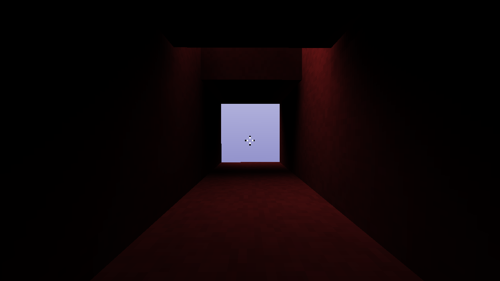

# Features
* Realtime software ray traced voxels
* Geometrically perfect reflections
* Render different texture regions based on face normal
* Screen door- and stochastic transparency
* Baked axis-aligned lightmaps with path tracing
* 3 types of denoisers for the lightmaps: basic 3x3 kernel blur, edge avoiding a trous wavelet transform and circular gaussian kernel blur

# Screenshots

